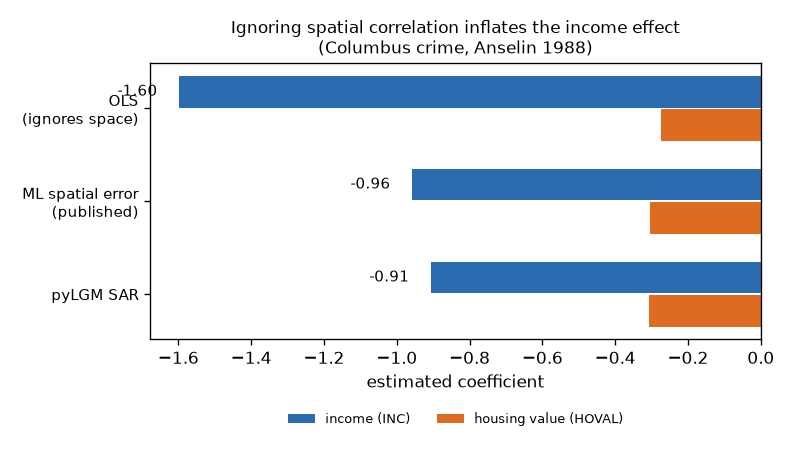
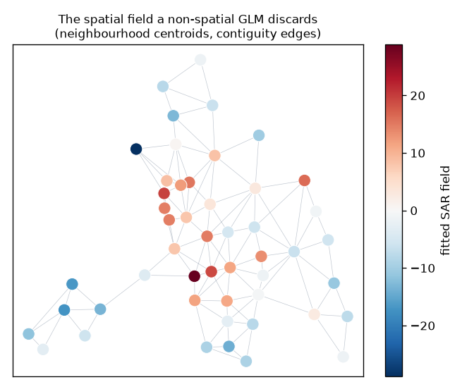

# Case study: reproducing Anselin (1988)

The Columbus, OH neighbourhood crime data is the reference dataset of spatial
econometrics — 49 contiguous neighbourhoods, residential burglaries and vehicle
thefts per 1000 households, regressed on household income and housing value.
It is the example every spatial-econometrics text works through, which makes it
the right place to check pyLGM against published numbers rather than against
itself.

The runnable script and data are in
[`examples/columbus_spatial_econometrics/`](https://github.com/Ardea00/pylgm/tree/main/examples/columbus_spatial_econometrics).

## The problem Anselin is pointing at

Fit the obvious regression and you get a large negative income coefficient:

```
CRIME = 68.62 − 1.597 · INC − 0.274 · HOVAL
```

But neighbourhoods are not independent draws. Crime spills across boundaries,
so the residuals are spatially correlated, and OLS — which assumes they are
not — attributes to *income* variation that is really **shared local structure**.
The coefficient is biased, and its standard error is optimistic.

## The model

pyLGM's [`SAR`](spatial-effects.md#directed-spatial-autoregressive-sar-effect)
effect puts a spatial-autoregressive field on the latent scale,

\[
Q = \tau\,(I - \rho W)^\top (I - \rho W),
\]

which is the **spatial error model** structure: \(y = X\beta + x\) with
\((I - \rho W)x = \varepsilon\). The field absorbs the shared local structure so
that \(\beta\) is left carrying only what income and housing value actually
explain.

```python
import json
import pandas as pd
from pylgm import Fixed, Gaussian, Hyperparameter, LGM
from pylgm.effects.spec import SAR

frame = pd.read_csv("examples/columbus_spatial_econometrics/data.csv", dtype={"id": str})
graph = json.loads(open("examples/columbus_spatial_econometrics/graph.json").read())

model = LGM(
    response="CRIME",
    predictor=Fixed("1 + INC + HOVAL") + SAR(
        "nbhd", "id", graph,
        rho=Hyperparameter("nbhd.rho", initial=0.0, transform="logit"),
        precision=Hyperparameter("nbhd.precision", initial=0.01, lower=1e-6, upper=1e3),
    ),
    likelihood=Gaussian(sigma=Hyperparameter("sigma", initial=5.0, lower=1e-2, upper=1e3)),
)
result = model.fit(frame)
```

Note `transform="logit"` on `rho` — it is confined to \((-1, 1)\), so the
default `log` transform would reject an initial value of `0.0`. See
[empirical Bayes](empirical-bayes.md#choosing-a-transform).

## The result

| model | const | INC | HOVAL | ρ / λ |
|---|---|---|---|---|
| published OLS | 68.619 | −1.5973 | −0.2739 | — |
| **OLS, recomputed here** | **68.619** | **−1.5973** | **−0.2739** | — |
| published ML spatial error | 60.279 | −0.9573 | −0.3046 | 0.5468 |
| **pyLGM `SAR`** | **59.543** | **−0.9057** | **−0.3058** | **0.5946** |



Two things are being checked here, and they are different.

The **OLS row matching the published values exactly** is the load-bearing one.
It verifies the data, the contiguity graph, and the specification — independent
of anything pyLGM does. If that row disagreed, nothing below it would mean
anything.

The **`SAR` row landing next to the published ML spatial-error estimates** is
the actual claim. `HOVAL` comes out at −0.3058 against −0.3046; the constant at
59.5 against 60.3. And the economic conclusion reproduces: ignoring spatial
correlation **overstates the income effect by 1.76×**.

## Why the fit is not identical, and should not be

pyLGM is not re-implementing maximum likelihood. Exact agreement would be
suspicious rather than reassuring. Two differences account for the spread:

- **It is Bayesian.** The latent field is shrunk by its prior and `ρ` is a
  posterior estimate, not an ML maximiser.
- **It carries a nugget.** `Gaussian(sigma=...)` sits alongside the spatial
  field, so observation noise and spatial noise compete for the same variance.
  The ML spatial-error model has no such term. Here the nugget is squeezed
  toward zero, which is why the estimates land as close as they do.

The visible consequence is ρ = 0.595 against λ = 0.547.

## What the spatial term is absorbing



Neighbourhood centroids, contiguity edges, coloured by the fitted `SAR` field.
The clustering is the point: neighbouring areas share elevated or depressed
crime beyond what income and housing value explain. That structure is exactly
what OLS folds into the income coefficient, and what the spatial field takes
back out.

## Takeaways

- Reproducing a published result is a **stronger check than a simulation**,
  because you did not choose the answer.
- Verify the baseline first. The exact OLS match is what licenses reading the
  `SAR` row at all.
- Expect a *close* match, not an identical one, when the estimator differs —
  and say which differences you expect to matter.
