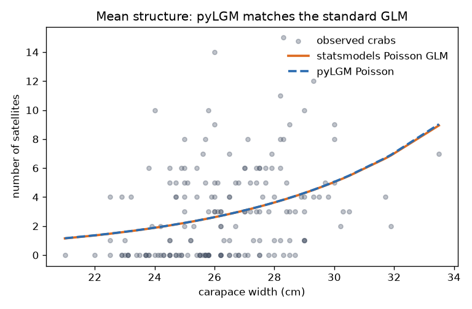
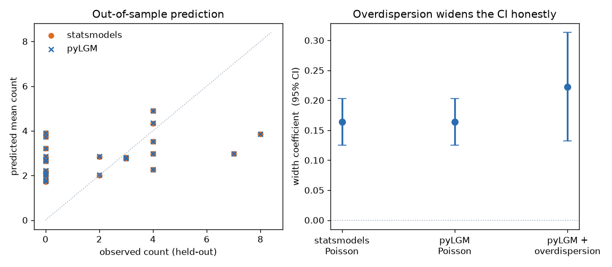

# Example: count regression vs. a standard GLM

A worked comparison on genuine, over-dispersed count data: the
Agresti/Brockmann **horseshoe crab** dataset (173 female crabs). Each crab has a
satellite count `sat` and a carapace `width`; bigger crabs attract more mates.
We fit the mean structure, benchmark it against a standard `statsmodels` Poisson
GLM, and show what pyLGM adds — an *estimated* overdispersion effect that makes
the uncertainty honest.

The full runnable script and data are in
[`examples/count_regression/`](https://github.com/Ardea00/pylgm/tree/main/examples/count_regression).

## The model

```python
import pandas as pd
from pylgm import LGM, Fixed, Poisson

frame = pd.read_csv("examples/count_regression/data.csv")
frame["width_c"] = frame["width"] - frame["width"].mean()

poisson = LGM(
    response="sat",
    likelihood=Poisson(),
    predictor=Fixed("1 + width_c"),
).fit(frame, engine="laplace")

coeff = poisson.latent_marginals("fixed")
print(coeff.mean[1], coeff.std[1])   # width slope and its posterior sd
```

## pyLGM matches the standard GLM

Fit the identical model with `statsmodels` and the estimates line up to three
decimals — the Laplace engine reproduces the maximum-likelihood GLM when the
predictor is fixed effects only:

| width coefficient (log-count per cm) | estimate | std. error |
| --- | --- | --- |
| `statsmodels` Poisson GLM | **+0.164** | 0.020 |
| pyLGM Poisson | **+0.164** | 0.020 |



## What pyLGM adds: honest overdispersion

Satellite counts are famously over-dispersed — the sample variance (9.9) is
more than three times the mean (2.9), so a plain Poisson understates
uncertainty. Add an IID per-crab effect with an *estimated* precision (a PC
prior on the standard deviation) and the width CI widens to reflect the extra
variability, without the point estimate drifting:

```python
from pylgm import Hyperparameter, IID, PCPrecision

overdispersed = LGM(
    response="sat",
    likelihood=Poisson(),
    predictor=Fixed("1 + width_c") + IID(
        "od", index="crab",
        precision=Hyperparameter("od_prec", initial=1.0,
                                 prior=PCPrecision(upper_sd=2.0, alpha=0.01))),
).fit(frame, engine="laplace")
```

| model | width coefficient | 95% CI half-width |
| --- | --- | --- |
| `statsmodels` Poisson | +0.164 | ±0.039 |
| pyLGM Poisson | +0.164 | ±0.039 |
| pyLGM + estimated overdispersion | +0.222 | ±0.090 |

The left panel below holds out 23 crabs and shows pyLGM predicts them
identically to the standard GLM; the right panel shows the coefficient CI
widening once overdispersion is modelled.



Out-of-sample RMSE is essentially identical (statsmodels 2.334, pyLGM 2.336):
the mean structure is the same, so predictive accuracy is the same — pyLGM's
value here is the *calibrated uncertainty*, not a different point forecast.

## Takeaways

- On a fixed-effects GLM, pyLGM **is** the standard GLM — same estimates, same
  predictions.
- Latent effects (`IID`, and the spatial and temporal effects) are how you go
  beyond it: here, an estimated overdispersion variance the GLM has no place to
  put. See [effects](effects.md) and
  [empirical Bayes and priors](empirical-bayes.md).
