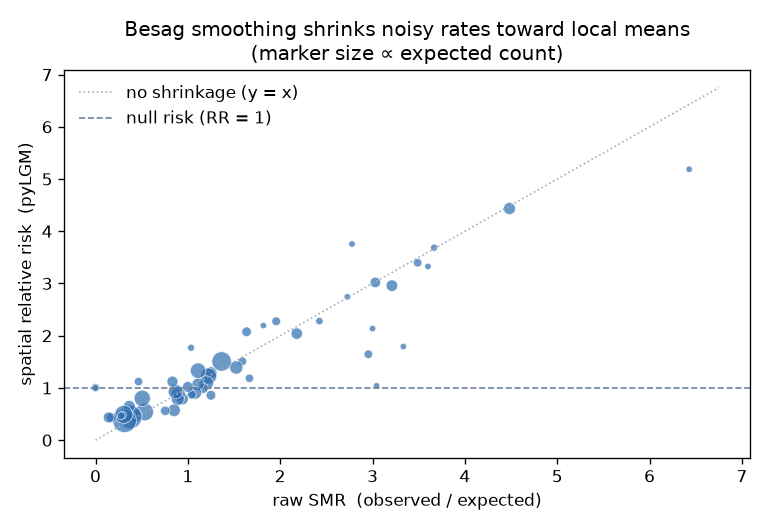
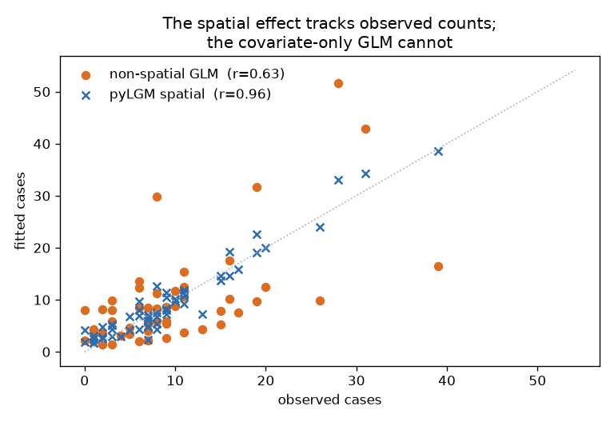

# Example: spatial disease mapping vs. a standard GLM

A worked comparison on the canonical **Scotland lip-cancer** data (56 districts,
the GeoBUGS example). For each district we have observed cases, an expected
count (age-standardised), and `aff` — the proportion of the workforce in
agriculture, fishing, and forestry, a proxy for outdoor sun exposure. Raw rates
in small districts are noisy; a spatial model borrows strength from neighbours.

The full runnable script and data are in
[`examples/disease_mapping/`](https://github.com/Ardea00/pylgm/tree/main/examples/disease_mapping).

## The model

```
observed_i ~ Poisson(mu_i)
log(mu_i)  = log(expected_i) + b0 + b1 * aff_i + s_i
```

where `s` is a [Besag (ICAR)](spatial-effects.md) spatial effect over the
district adjacency graph. The expected count enters as an
[offset](likelihoods.md); the covariate is an ordinary `Fixed` term; the
spatial precision is estimated with a PC prior.

```python
import json
import numpy as np
import pandas as pd
from pylgm import LGM, Besag, Fixed, Hyperparameter, PCPrecision, Poisson

frame = pd.read_csv("examples/disease_mapping/data.csv")
frame["area"] = frame["area"].astype(str)
frame["log_E"] = np.log(frame["expected"])
graph = json.loads(open("examples/disease_mapping/graph.json").read())

result = LGM(
    response="observed", likelihood=Poisson(), offset="log_E",
    predictor=Fixed("1 + aff") + Besag(
        "spatial", index="area", graph=graph,
        precision=Hyperparameter("spatial_prec", initial=1.0,
                                 prior=PCPrecision(upper_sd=1.0, alpha=0.01))),
).fit(frame, engine="laplace")
```

## Spatial smoothing shrinks noisy rates

The raw standardised mortality ratio (SMR = observed / expected) swings from 0
to 6.4 across districts, much of that sampling noise in small populations. The
Besag effect pulls extreme SMRs toward the level of their neighbours — the
classic disease-mapping shrinkage — tightening the relative-risk spread from
sd 1.31 to 1.10:



## It fits far better than a covariate-only GLM

A standard non-spatial `statsmodels` Poisson GLM with the same offset and the
same `aff` covariate has nowhere to absorb the district-to-district variation
the covariate does not explain. Adding the spatial effect lifts the correlation
between fitted and observed counts from **0.63 to 0.96**:

| model | corr(fitted, observed) |
| --- | --- |
| non-spatial Poisson GLM (`aff` only) | 0.63 |
| pyLGM + Besag spatial effect | **0.96** |



The `aff` coefficient stays positive throughout (GLM +0.74; spatial model
+0.50 ± 0.12) — once neighbouring risk is accounted for, part of what the GLM
loaded onto the covariate is explained by spatial structure, a more honest
attribution. The estimated spatial precision is ≈ 4.1.

## Takeaways

- Spatial effects turn a covariate regression into a *disease-mapping* model:
  neighbouring areas share information, so small-area estimates stop chasing
  noise.
- The comparison is apples-to-apples — same likelihood, offset, and covariate —
  so the jump in fit (0.63 → 0.96) is purely the spatial random effect. See
  [spatial effects](spatial-effects.md) for `Besag`, `ProperCAR`, and `BYM2`,
  and [the theory page](theory.md) for why ICAR scaling matters.
