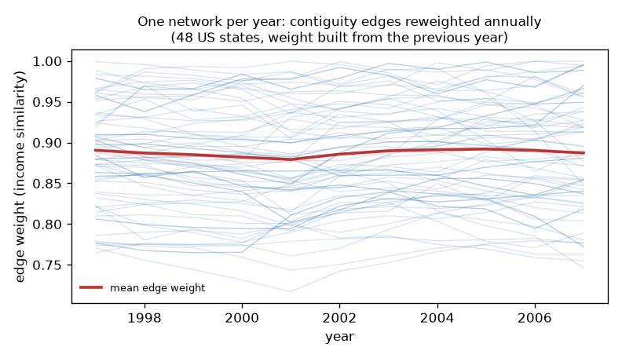
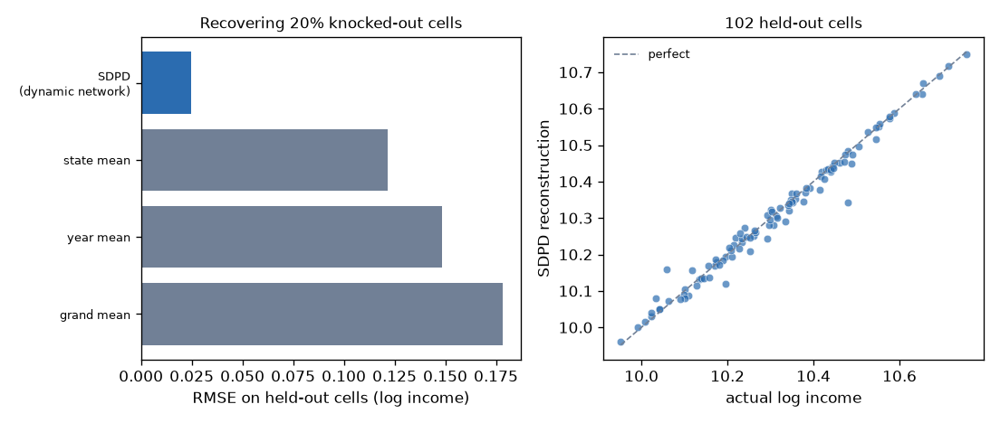

# Case study: a network that changes every year

Most spatial models fix the network once and reuse it for every period. Economic
influence does not sit still: who a region actually co-moves with shifts over a
decade. [`DynamicSpatialPanel`](spatial-effects.md#dynamic-spatial-panel-sdpd)
takes **one network per period**, so the graph itself is a time series.

The runnable script and data are in
[`examples/state_income_dynamic_network/`](https://github.com/Ardea00/pylgm/tree/main/examples/state_income_dynamic_network).

## The data and the network

Per-capita income for the 48 contiguous US states, 1997–2007, from the Bureau of
Economic Analysis. The **topology** is real geography — state contiguity — but
the **edge weights are economic**: neighbouring states are linked more strongly
when their income levels are close.

\[
W_t[i, j] \;=\; \frac{1}{1 + \bigl|\log y_{i,t-1} - \log y_{j,t-1}\bigr|}
\qquad\text{for contiguous } i, j.
\]

The weight for year \(t\) is built from year \(t-1\), so **the network never sees
the value being modelled**. That matters for the forecast at the end: the same
construction works for a future period without leaking its target.



Each faint line is one contiguity edge tracked across the decade. The mean
(red) is nearly flat while individual edges move substantially — the aggregate
level of similarity is stable, but *which* states resemble which is not. A
static `W` would average that away.

## The model

```python
from pylgm import Fixed, Gaussian, Hyperparameter, LGM
from pylgm.effects.spec import DynamicSpatialPanel

effect = DynamicSpatialPanel(
    "dyn", "state", "year", graphs,          # graphs = {year: weighted_graph}
    rho=Hyperparameter("dyn.rho", initial=0.0, transform="logit"),
    gamma=Hyperparameter("dyn.gamma", initial=0.9, transform="identity",
                         lower=-2.0, upper=2.0),
    eta=Hyperparameter("dyn.eta", initial=0.0, transform="identity",
                       lower=-2.0, upper=2.0),
    precision=Hyperparameter("dyn.precision", initial=100.0, lower=1e-2, upper=1e7),
)
result = LGM(response="loginc", predictor=Fixed("1") + effect,
             likelihood=Gaussian(sigma=0.02)).fit(frame)
```

`gamma` and `eta` take `transform="identity"`: unlike `rho` they are not
confined to \((-1, 1)\), so they live on the real line.

## Three coefficients a static model conflates

```
rho   (neighbour spillover, same year) = +0.6393
gamma (own persistence, one year back) = +1.0052
eta   (neighbour spillover, lagged)    = −0.5960
```

- **ρ** — how much of a state's position is explained by its neighbours' *this*
  year.
- **γ** — how much carries over from its own last year. At ≈ 1 this is a
  near-unit root: log income is close to a random walk.
- **η** — how much of last year's *neighbours* reaches a state this year.

ρ > 0 with η < 0 is the familiar spatial error-correction shape: strong
contemporaneous co-movement with neighbours, partly unwound the year after. A
model with a single spatial parameter cannot express that at all — it has to
average the two into one number.

## Where the structure earns its keep

Panels have holes: late revisions, small units, series that start later. Knock
out 20% of the cells and ask each method to restore them.



| method | RMSE ↓ (log income) |
|---|---|
| **`DynamicSpatialPanel`** | **0.0246** |
| state mean | 0.1214 |
| year mean | 0.1484 |
| grand mean | 0.1786 |

About **5× closer** than the obvious baselines, because a missing cell is
reconstructed from *both* its own history and its neighbours' current values —
the two axes the baselines each use only one of.

Mechanically this is the ordinary [`NaN`-response
workflow](prediction.md#predicting-new-rows): held-out rows keep their latent
cell and contribute no likelihood, and the SDPD precision couples that cell to
its neighbours in space and time.

## Where it does not win

The example also forecasts 2008–09 and reports the honest answer:

| year | SDPD | last value |
|---|---|---|
| 2008 | 0.0397 | **0.0291** |
| 2009 | 0.1242 | **0.0255** |

A last-value benchmark wins. That is not a defect, and it follows directly from
γ ≈ 1.005: for a random walk the last observed value **is** the optimal
forecast, and no amount of structure beats it at its own game.

The useful reading is that these two results are about different questions.
Filling a gap is an *interpolation* problem, where knowing the neighbours helps
a great deal. Forecasting a near-unit-root series is an *extrapolation* problem,
where there is little to know. A model that is good at one is not automatically
good at the other, and a page that reported only the flattering number would be
worth less than one you can check.

## The forecast helper returns the latent field

```python
from pylgm import forecast_dynamic_spatial_panel

forecast = forecast_dynamic_spatial_panel(result, effect, {"2008": w_2008})
beta = dict(zip(result.labels, result.mean))
forecast["predicted"] = forecast["latent_mean"] + beta["fixed:Intercept"]
```

`latent_mean` / `latent_variance` are the SDPD field alone — the fixed effects
are excluded, because future covariate values are an input the helper is not
given. Add them yourself before comparing with observations.

## Cost

SDPD is the most expensive effect in the library: the block-bidiagonal operator
is rebuilt at every hyperparameter evaluation, and cost grows superlinearly in
`units × periods` (481 cells ≈ 6s, 961 cells ≈ 72s with two estimated
coefficients). Fix the coefficients you do not need estimated.

## Takeaways

- A time-varying `W` is worth it when *who resembles whom* moves, even if the
  aggregate level of connection does not.
- Splitting ρ / γ / η separates contemporaneous spillover, persistence and
  diffusion, which a single spatial parameter blends.
- Structure helps most where you are **interpolating** within the panel, least
  where you are extrapolating a random walk.
